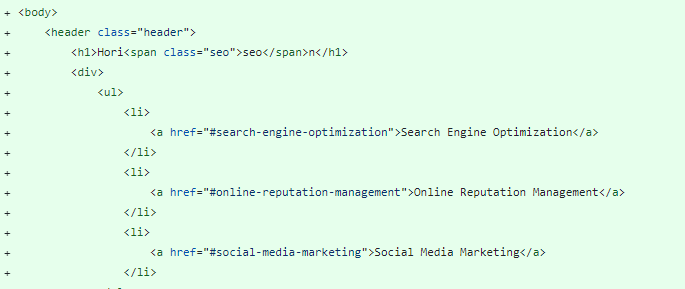
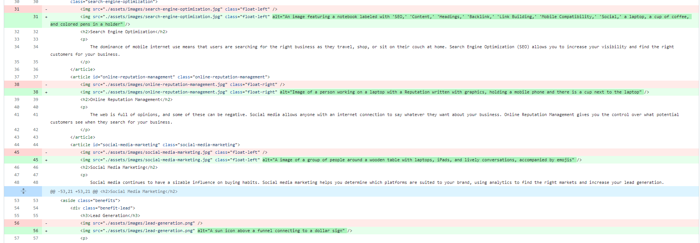
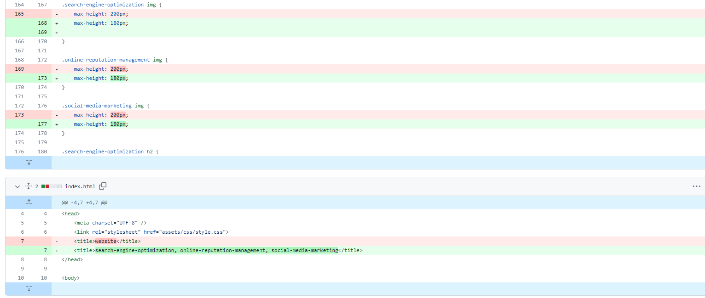

# Search-Engine-Optimization-Website-Accessibility
Search Engine Optimization Website/Accessibility

# Search-Engine-Optimization-Website-Accessility_Applications

## Description

This is the README for a homework project that involved making several changes and improvements to a Search Engine Optimization website. The primary enhancements made to the project are as follows:

1. **Logical Structure:** The HTML file was updated to ensure a well-organized and logical structure. This involved using appropriate HTML elements such as `<header>`, `<nav>`, `<section>`, `<aside>`, and `<footer>`.
 

2. **Headings:** Proper heading hierarchy was established, providing a clear and sequential structure to the content. This ensures that the content is well-organized and accessible.

3. **Image Alt Attributes:** Alt attributes were added to images to enhance accessibility and provide text descriptions for each image, making the content more user-friendly.

5. **Image Size:** Image sizes were adjusted to improve the overall layout and appearance of the content.

6. **Title Improvement:** The title of the HTML document was modified to be more concise and descriptive, making it easier for users to understand the purpose of the page.

These changes were made to improve the structure, accessibility, and readability of the HTML document. The project demonstrates an understanding of HTML best practices and the importance of creating well-structured and user-friendly web content.

## Table of Contents

* [Installation](#installation)
* [Usage](#usage)
* [Contributors](#contributors)
* [License](#license)

## Installation

As this is a homework project, there is no specific installation process required. You can simply access the HTML file in a web browser to view the changes and improvements.

## Usage

The updated HTML file can be opened in a web browser to see the changes in action. Review the changes in the logical structure, headings, image alt attributes, image sizes, and the improved title.

## Contributors

This homework project was completed by Fetie. It is a demonstration of HTML and web development skills learned during the EDx Frontend Development Programme. 

## License

This project is open-source and available under the [MIT License](https://choosealicense.com/licenses/mit/).

---
